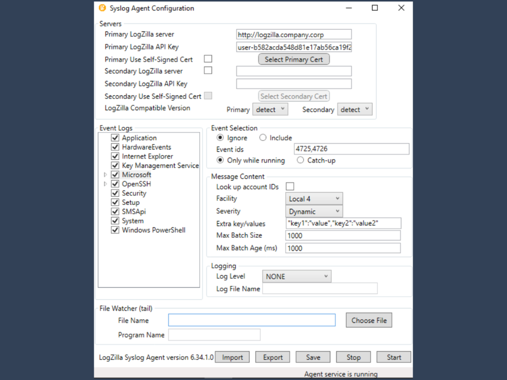
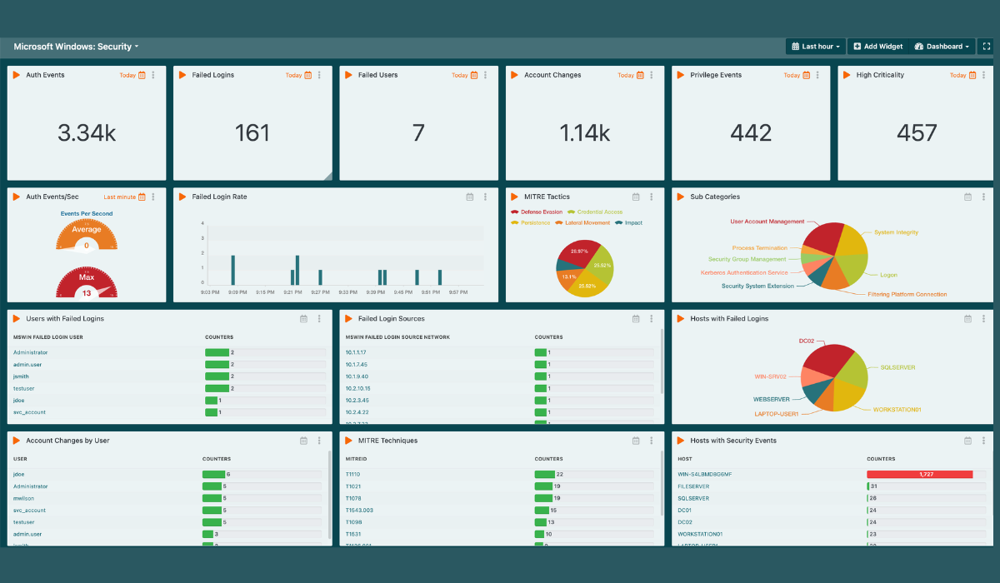

# LogZilla Syslog Agent for Windows

The LogZilla Syslog Agent is a Windows service that monitors Windows Event Logs
and forwards events to your LogZilla server via HTTP or HTTPS. It supports
primary and secondary server configurations, custom event filtering, and
catch-up processing for events that occurred while the service was stopped.

**Version:** 6.43.1.0

## Table of Contents

- [System Requirements](#system-requirements)
- [Installation](#installation)
- [Configuration](#configuration)
- [Upgrading](#upgrading)
- [Uninstallation](#uninstallation)
- [Troubleshooting](#troubleshooting)
- [Advanced Configuration](#advanced-configuration)

## System Requirements

- **Operating System:** Windows Server 2016 or later, Windows 10/11 (64-bit)
- **Memory:** 100 MB RAM minimum
- **Disk Space:** 50 MB for installation
- **Network:** HTTP or HTTPS connectivity to LogZilla server
- **Permissions:** Administrator privileges required for installation

## Installation

### Step 1: Install Windows App in LogZilla (Required First)

Before installing the agent, you must install the Windows companion app in LogZilla to ensure events are properly formatted from the start:

1. Log in to your LogZilla server
2. Navigate to **Settings → Appstore**
3. Find and install the **Windows** app
4. This app processes and displays Windows Event Log data in LogZilla

### Step 2: Download the Installer

Download `LogZilla_Winagent.msi` from the
[Releases](https://github.com/logzilla/winagent-releases/releases) page.

### Step 3: Run the Installer

1. Right-click `LogZilla_Winagent.msi` and select **Run as administrator**
2. Follow the installation wizard prompts
3. Click **Install** to begin installation

The installer will:

- Install the agent service (`SyslogAgent.exe`)
- Install the configuration GUI (`SyslogAgentConfig.exe`)
- Register the Windows Event Log source "LogZilla SyslogAgent"
- Create registry keys under `HKLM\SOFTWARE\LogZilla\SyslogAgent`

### Step 4: Verify Installation

After installation completes, the service is installed but not yet running.
You'll configure and start it in the next section.

## Configuration

### Using the Configuration GUI

The agent includes a graphical configuration tool for easy setup.

#### Step 1: Launch the Configuration Tool

1. Start Menu → **Syslog Agent Configuration**
2. Or run: `C:\Program Files\LogZilla\SyslogAgent\SyslogAgentConfig.exe`



#### Step 2: Configure Primary Server

In the **Servers** section:

1. **Primary LogZilla server:** Enter your LogZilla server URL
   - Format: `http://192.168.10.126` or `https://your-logzilla-server.com`
   - Use `http://` for unencrypted connections or `https://` for TLS

2. **Primary LogZilla API Key:** Enter your API key from LogZilla
   - Get this from LogZilla: Settings → API Keys → Create Key

3. **Primary Use Self-Signed Cert:** (Optional - only needed for HTTPS with
   self-signed certificates)
   - Leave unchecked if using HTTP or trusted HTTPS certificates
   - Check and click **Select Primary Cert** to browse for `.pem` file if using
     self-signed HTTPS

#### Step 3: Configure Event Logs (Optional)

In the **Event Logs** section:

1. Check the event log channels you want to monitor:
   - **Application** — Application events
   - **Security** — Security audit events
   - **System** — System events
   - **OpenSSH** — SSH server events (if installed)
   - And many more...

2. Default selection monitors: Application, Security, System

#### Step 4: Configure Event Selection

In the **Event Selection** section:

1. **Event Selection Mode:**
   - **Ignore** — Forward all events (default)
   - **Include** — Only forward specific Event IDs

2. **Event IDs:** (if Include mode selected)
   - Enter comma-separated Event IDs: `4624,4625,4726`

3. **Catch-up vs Only while running:**
   - **Catch-up** — Process backlog when service starts (default)
   - **Only while running** — Ignore events that occurred while stopped

#### Step 5: Configure Message Content

1. **Look up account IDs:** Check to resolve SIDs to usernames (recommended)

2. **Facility:** Syslog facility code (default: `Local4`)

3. **Severity:** How to map Windows event levels to syslog severity
   - **Dynamic** — Maps based on event type (recommended)
   - Or select fixed severity

4. **Extra key/values:** Add custom fields to all events
   - Format: `"environment":"production","datacenter":"us-east"`

5. **Max Batch Size:** Events per batch (default: `1000`)

6. **Max Batch Age (ms):** Max milliseconds to wait before sending partial batch
   (default: `1000`)

#### Step 6: Configure Logging (For Debugging/Tech Support Only)

**Note:** Logging is disabled by default and should only be enabled when troubleshooting issues with technical support.

In the **Logging** section:

1. **Log Level:** Leave set to **NONE** unless instructed by support
   - **NONE** — No logging (default, recommended)
   - **ERROR** — Errors only
   - **WARN** — Warnings and errors
   - **INFO** — Informational messages
   - **DEBUG** — Detailed debugging (use only when requested by support)

2. **Log File Name:** Specify where to write debug logs (only used if Log Level is not NONE)
   - Example: `C:\Users\Administrator\Desktop\agent-debug.log`

#### Step 7: Save and Start

1. Click **Save** to write configuration to registry
2. Click **Start** to start the agent service
3. Verify status at bottom shows **Agent service is running**

#### Step 8: Verify Events in LogZilla

1. Navigate to **Events** or **Dashboard** in LogZilla
2. You should see events from your Windows host appearing within seconds



## Upgrading

### Automatic Upgrade (Recommended)

The MSI installer supports in-place upgrades:

1. Download the new `LogZilla_Winagent.msi` version
2. Run the installer (no need to uninstall first)
3. The installer will:
   - Stop the running service gracefully (waits up to 120 seconds for queue
     drain)
   - Preserve all registry configuration
   - Replace binaries with new version
   - Restart the service automatically

**Your configuration is preserved** — no need to reconfigure after upgrade.

### Verify Upgrade

After upgrade:

1. Open **Syslog Agent Configuration**
2. Check version in bottom-left corner: `LogZilla Syslog Agent version 6.43.1.0`
3. Verify service is running: **Agent service is Running**

### Manual Upgrade (If Needed)

If the automatic upgrade fails:

1. Stop the service:

   ```powershell
   Stop-Service "LZ Syslog Agent"
   ```

2. Export your configuration (optional backup):
   - Open **Syslog Agent Configuration**
   - Click **Export** → Save to file

3. Uninstall old version:
   - Control Panel → Programs → Uninstall **LZ Syslog Agent**

4. Install new version:
   - Run new `LogZilla_Winagent.msi`

5. Import configuration (if you exported):
   - Open **Syslog Agent Configuration**
   - Click **Import** → Select saved file
   - Click **Save**

## Uninstallation

### Using Windows Settings

1. **Windows 10/11:**
   - Settings → Apps → Apps & features
   - Search for **LZ Syslog Agent**
   - Click **Uninstall**

2. **Windows Server:**
   - Control Panel → Programs and Features
   - Select **LZ Syslog Agent**
   - Click **Uninstall**

### Using MSI

Run from elevated PowerShell:

```powershell
msiexec /x LogZilla_Winagent.msi
```

### What Gets Removed

- Agent service (`SyslogAgent.exe`)
- Configuration GUI (`SyslogAgentConfig.exe`)
- Program files in `C:\Program Files\LogZilla\SyslogAgent\`

### What Gets Preserved

- Registry configuration under `HKLM\SOFTWARE\LogZilla\SyslogAgent`
- Log files in `C:\ProgramData\LogZilla\`

To completely remove configuration:

```powershell
Remove-Item "HKLM:\SOFTWARE\LogZilla" -Recurse -Force
Remove-Item "C:\ProgramData\LogZilla" -Recurse -Force
```

## Troubleshooting

### Service Won't Start

**Check Event Viewer:**

1. Open **Event Viewer** (`eventvwr.msc`)
2. Navigate to **Windows Logs → Application**
3. Look for **Source: LogZilla SyslogAgent**
4. Event ID 1000 = Service started successfully
5. Event ID 1003 = Fatal error (check message for details)

**Common Issues:**

- **Invalid API Key:** Verify API key in LogZilla server
- **Network connectivity:** Test HTTP/HTTPS connection to server
- **Certificate issues:** If using HTTPS with self-signed cert, ensure `.pem`
  file is valid and checkbox is checked

**Enable Debug Logging:**

1. Open **Syslog Agent Configuration**
2. Set **Log Level** to **DEBUG**
3. Set **Log File Name** to `C:\Users\Administrator\Desktop\debug.log`
4. Click **Save** → **Stop** → **Start**
5. Check debug.log for detailed error messages

### Events Not Appearing in LogZilla

**Verify Service is Running:**

```powershell
Get-Service "LZ Syslog Agent"
```

Should show `Status: Running`

**Check Agent Logs (if logging is enabled):**

If you previously enabled debug logging, check the configured log file for errors.

**Test Network Connectivity:**

For HTTP:

```powershell
Test-NetConnection -ComputerName 192.168.10.126 -Port 80
```

For HTTPS:

```powershell
Test-NetConnection -ComputerName your-logzilla-server.com -Port 443
```

Should show `TcpTestSucceeded: True`

**Verify Event Logs are Selected:**

1. Open **Syslog Agent Configuration**
2. Ensure desired event log channels are checked (Application, Security, System)
3. Click **Save** → **Stop** → **Start**

### High Memory Usage

The agent typically uses 30-50 MB of RAM. If memory usage is high:

1. Check **QueueCap** registry value — default is 50,000 events
2. Reduce queue size if needed:

   ```powershell
   Set-ItemProperty -Path "HKLM:\SOFTWARE\LogZilla\SyslogAgent" -Name "QueueCap" -Value 25000 -Type DWord
   ```

3. Restart service

### Events Being Dropped

**Check for Event ID 1001:**

Event ID 1001 in Application log indicates queue overflow. This means events are
arriving faster than the agent can forward them.

**Solutions:**

1. **Increase QueueCap:**

   ```powershell
   Set-ItemProperty -Path "HKLM:\SOFTWARE\LogZilla\SyslogAgent" -Name "QueueCap" -Value 100000 -Type DWord
   ```

2. **Reduce event volume:**
   - Use Event Selection → Include mode
   - Specify only critical Event IDs

3. **Check network bandwidth** to LogZilla server

**Check for Event ID 1002:**

Event ID 1002 reports total events dropped after queue drains. Review the event
message for drop count and time range.

## Advanced Configuration

### Registry Settings

All configuration is stored in `HKLM\SOFTWARE\LogZilla\SyslogAgent`. Advanced
users can edit registry directly or use `.reg` files for import/export.

**Key Registry Values:**

| Value | Type | Default | Description |
|-------|------|---------|-------------|
| `QueueCap` | DWORD | 50000 | Max events in forwarding queue |
| `CatchupCap` | DWORD | 500000 | Max historical events on startup |
| `EventLogPollInterval` | DWORD | 10 | Milliseconds between event log polls |
| `Syslog1` | String | (required) | Primary LogZilla server URL |
| `Facility` | DWORD | 20 | Syslog facility code (20 = Local4) |
| `Severity` | DWORD | 8 | Severity mapping (8 = Dynamic) |
| `DebugLevel` | DWORD | 3 | Log level (1=ERROR, 2=WARN, 3=INFO, 5=DEBUG) |

### Import/Export Configuration

**Export to .reg file:**

```powershell
reg export "HKLM\SOFTWARE\LogZilla\SyslogAgent" C:\backup\agent-config.reg
```

**Import from .reg file:**

```powershell
reg import C:\backup\agent-config.reg
```

Or use the GUI **Export** / **Import** buttons.

### Secondary Server Configuration

For high availability, configure a secondary LogZilla server:

1. Check **Secondary LogZilla server** checkbox
2. Enter secondary server URL and API key
3. Select **LogZilla Compatible Version** for each server (or use **detect**)
4. Click **Save**

The agent sends events to **both** primary and secondary servers simultaneously.

### File Watcher (Tail Mode)

Monitor a log file and forward new lines as events:

1. **File Name:** Path to log file (e.g., `C:\Logs\app.log`)
2. **Program Name:** Identifier for events (e.g., `MyApp`)
3. Click **Save**

New lines appended to the file will be forwarded as syslog events with the
specified program name.

## Support

- **Documentation:** [LogZilla Documentation](https://www.logzilla.ai/docs)
- **Support Portal:** [LogZilla Support](https://support.logzilla.net)
- **GitHub Issues:** [Report a Bug](../../issues)

## License

Copyright © 2021-2026 LogZilla Corporation. All rights reserved.
